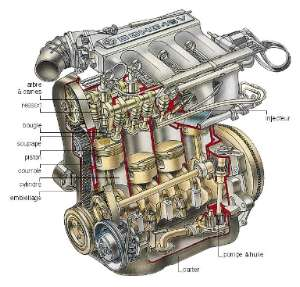
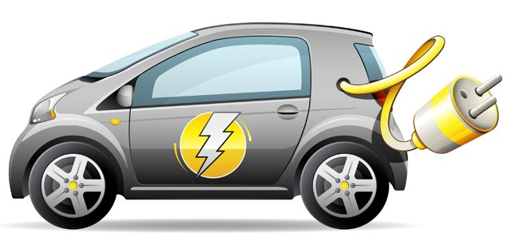
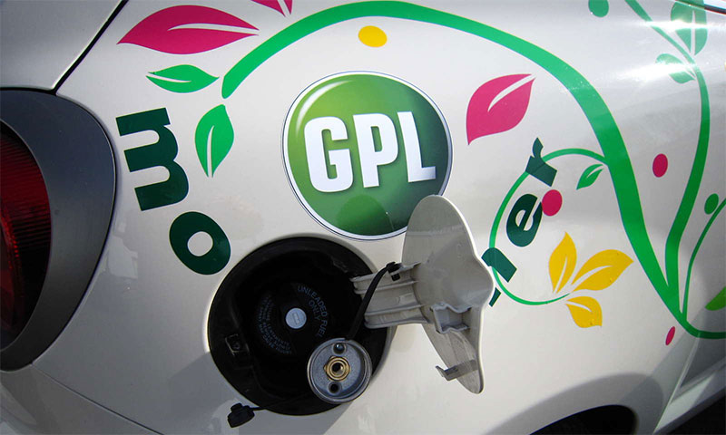
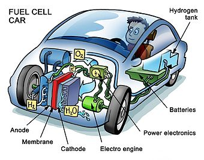
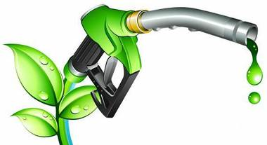

L'automobile: les différentes sources d'énergie possibles
=========================================================

Quelle que soit la source d'énergie utilisée par les automobiles, celle-ci a des conséquences sur l'environnement.

Cependant certaines sources d'énergie sont plus polluantes que d'autres.

 

Cette page web vous présente différentes sources d'énergie utilisées par les automobiles, leur provenance, et leurs différentes émissions dans l'environnement.

## L'essence 	

 L'essence et ses dérivés sont fabriqués à partir du pétrole.

Le moteur à essence émet des gaz d'échappement ( contenant du monoxyde de carbone, des particules...) dangereux pour l'environnement et contribuant à l'effet de serre (réchauffement de la planète).	

		
## L'électricité 	

L'électricité est le plus « propre » des carburants: Aucune émission, voire aucune consommation de ressources fossiles (charbon...) si l'électricité provient de centrales nucléaires ou hydrauliques.
	

	
## Le G.P.L. et le G.N.V. 	

Les performances environnementales du G.P.L. (Gaz de Pétrole Liquéfié) ou du G.N.V. ( Gaz naturel pour véhicule ) sont bonnes : pas d'émission de particules, pas d'évaporation et une diminution des polluants par rapport à l'essence allant jusqu'à 60% pour le monoxyde de carbone.		

## La pile à combustible

Déjà utilisée dans le domaine spatial, et testée sur des prototypes automobiles ( Mercédès classe A ou Laguna de Renault entre autres). Elle produit de l'électricité par électrolyse de l'hydrogène et de l'oxygène gazeux qui mis en présence dégagent de l'énergie et.... de l'eau. Un avantage majeur: l'hydrogène et l'oxygène sont des ressources inépuisables.
		

## Les biocarburants

Ils sont produits à partir de plantes et permettent de réduire les polluants liés à la combustion des hydrocarbures et ne contribuent pas au renforcement de l'effet de serre.

Deux familles de biocarburant sont aujourd'hui bien développées:

_ l'éthanol (un alcool) et son dérivé l'ETBE sont produits à partir de betterave, de blé, de maïs, de canne à sucre.

 

_l'ester méthylique de colza (EMC) est produit à partir de l'huile de colza (une plante) .

Mélangés dans l'essence ils font baisser l'émission de particules, des fumées et des gaz précurseurs de l'ozone. Ils sont toutefois moins propres que le G.P.L ou le G.N.V.