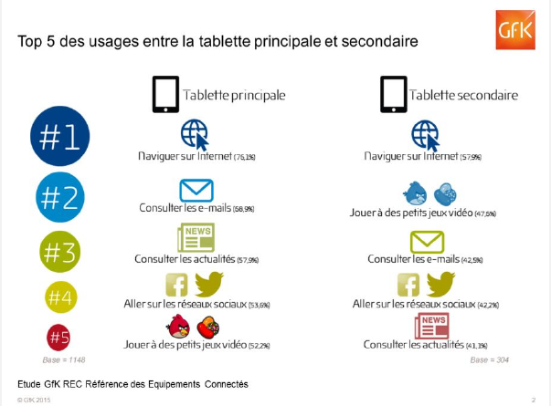
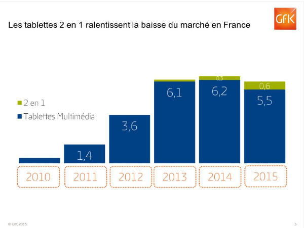

# LA TABLETTE TACTILE

<small> *Extraits de l'étude "Quel relais de croissance pour la tablette ?" du 28/05/15 de l' institut [GFK](http://www.gfk.com/fr) *</small>

## Extrait n°1 : 

Le marché de la tablette tactile souffre d’un double phénomène :

- Saturation du marché, car depuis 2010, il s’est écoulé 18 millions de tablettes multimédia en France et le marché tend désormais à atteindre la taille naturelle, soit environ 5 millions d’unités par an
- Concurrence des Smartphones dotés d’un écran large.

## Extrait n°2 : 

**Evolution du marché de la tablette en France entre 2010 et 2014**

|Année | Ventes ( en millions d' unités) |Prix moyen T.T.C.|
|:----:|:-------------------------------:|:---------------:|
| 2010 |  0,4                            |373€             |
| 2011 |  1,4                            |326€             |
| 2012 |  3,6                            |331€             |
| 2013 |  6,1                            |233€             |
| 2014 |  6,2                            |203€             |

## Extrait n°3 :

Malgré la multiplication des écrans, les tablettes semblent avoir un usage
complémentaire du téléviseur, du PC et du smartphone, même si 17% des
possesseurs de tablette déclarent préférer consulter l’actualité sur leur
tablette plutôt que sur leur PC et 19% affirment préférer naviguer sur inter-
net depuis leur tablette plutôt que depuis leur smartphone.
En effet, le confort, la simplicité d’usage et la qualité de l’écran sont les
caractéristiques les plus appréciées par les utilisateurs de tablette.
En 2015, le marché de la tablette multimédia devrait reculer de 11% mais
les 2 en 1 – tablettes dotées d’un système d’exploitation de PC – devraient
monter en puissance et se vendre à hauteur de 600 000 unités.

