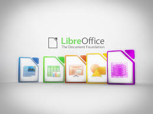
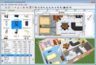
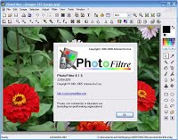
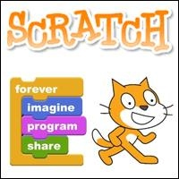
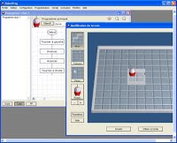
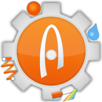

# Logiciels libres ou gratuits

## Libreoffice
Suite bureautique complète et gratuite

[Téléchargement](https://fr.libreoffice.org/)

## Sweet Home 3D
Logiciel d' aménagement intérieur

[Téléchargement](http://www.sweethome3d.com/fr/download.jsp)

## Photofiltre
Logiciel de retouche d' image

[Téléchargement](http://photofiltre.free.fr/frames.htm)

## Scratch
La programmation facile

[Téléchargement](https://scratch.mit.edu/scratch2download/)

## RobotProg
Programmer un robot.

[Téléchargement](http://www.physicsbox.com/indexrobotprogfr.html)

## Algodoo
Logiciel de simulation du comportement d'objets

[Téléchargement](http://recitmst.qc.ca/algodoo/)

## Mblock
Logiciel de pilotage du robot mbot

[Téléchargement](http://www.mblock.cc/download/)
